# Understanding PluginInputReaderSystem and SystemBase

Great question! Let me break this down from the ground up.

---

## What is SystemBase?

### The Basics

`SystemBase` is a **base class from Unity's ECS (Entity Component System)** that you extend to create systems. Think of it as a template for creating "logic processors" that run every frame.

```csharp
public class MySystem : SystemBase
{
    protected override void OnUpdate()
    {
        // This runs every frame!
    }
}
```

### Why It Matters for Our Architecture

The document specifically says:

> **Unified system** - same `PluginInputReaderSystem` (SystemBase) runs in both ECS and HybridMono worlds

This is **crucial**! Here's why `SystemBase` was chosen:


**Key Point**: `SystemBase` is a **managed class** (not a struct), which means:
- It can exist in both pure ECS worlds AND HybridMono worlds
- We write the logic **once** and it works for both SubScene vehicles and GameObject vehicles
- No code duplication!

---

## How PluginInputReaderSystem Works

Let me walk you through the entire flow step by step.

### Step 1: System Lifecycle

```csharp
public class PluginInputReaderSystem : SystemBase
{
    protected override void OnCreate()
    {
        // Called once when system is created
        // Setup goes here
    }

    protected override void OnUpdate()
    {
        // Called EVERY FRAME
        // This is where our input reading happens
    }
}
```

### Step 2: The OnUpdate Loop (Every Frame)

Here's what happens each frame :


---

## The Complete Data Flow

Let me show you the **complete journey** from pressing a button to the car moving:

```mermaid
flowchart TB
    subgraph Frame["🎮 Single Frame Timeline"]
        direction TB
        
        subgraph Input["1️⃣ Input Reading Phase"]
            Press["Player presses W key"]
            Press --> Device["Unity Input System detects it"]
        end
        
        subgraph Reader["2️⃣ PluginInputReaderSystem.OnUpdate()"]
            GetPlugin["Get active plugin:<br/>InputSystemProvider"]
            Query["Query vehicles with<br/>PlayerIdentifier"]
            
            subgraph Loop["For each vehicle"]
                GetID["Get PlayerIdentifier.Id = 0"]
                CallPlugin["Call plugin.GetThrottle(0)"]
                PluginReads["Plugin reads from device"]
                WriteInputs["Write to Powertrain.Inputs.Throttle = 1.0"]
            end
            
            GetPlugin --> Query --> Loop
        end
        
        subgraph Powertrain["3️⃣ Powertrain System.OnUpdate()"]
            ReadInputs["Read Powertrain.Inputs.Throttle"]
            ApplyForce["Calculate engine force"]
            UpdatePhysics["Apply to wheels/physics"]
        end
        
        subgraph Result["4️⃣ Result"]
            CarMoves["🏎️ Car accelerates!"]
        end
    end
    
    Input --> Reader --> Powertrain --> Result
```




---

## Why This Architecture is Smart

### 1. **Separation of Concerns**

```
┌─────────────────────────────────────┐
│   PluginInputReaderSystem           │  ← Knows HOW to distribute input
│   "The Dispatcher"                  │     to vehicles
└─────────────────────────────────────┘
              ↓ uses
┌─────────────────────────────────────┐
│   PluginInputProvider                │  ← Knows WHERE input comes from
│   "The Input Source"                │     (keyboard, gamepad, etc.)
└─────────────────────────────────────┘
```

The **system** doesn't care if input comes from a keyboard, gamepad, or network. It just asks the **plugin** for values.

### 2. **Works Everywhere**

```
SubScene Vehicle (ECS Entity)
    ↓
PluginInputReaderSystem in ECS World
    ↓
Reads from plugin, writes to Powertrain.Inputs
    ✓ Works!

GameObject Vehicle (Hybrid Entity)
    ↓
PluginInputReaderSystem in HybridMono World
    ↓
Reads from plugin, writes to Powertrain.Inputs
    ✓ Same code, works here too!
```

### 3. **RequireForUpdate Optimization**

The document mentions this:

> **Uses `RequireForUpdate`:**
> - Requires `PlayerIdentifier` component
> - System auto-disables when no vehicles with these components exist

This means:

```csharp
protected override void OnCreate()
{
    RequireForUpdate<PlayerIdentifier>();
    RequireForUpdate<Powertrain.Inputs>();
}
```

**What this does:** If there are no vehicles with both components in the world, the system **completely skips** running. Zero overhead! This is especially useful in menus or cutscenes where no player vehicles exist.

---

## Split-Screen Example

This is where it gets really cool. Let's say you have 2 players:

```csharp
// Frame N: System runs

// Vehicle 1 has PlayerIdentifier.Id = 0
plugin.GetSteering(0)  // Plugin internally checks: "Player 0 uses keyboard"
                       // Returns Input.GetAxis("Horizontal") 
                       // Result: 0.5

// Vehicle 2 has PlayerIdentifier.Id = 1  
plugin.GetSteering(1)  // Plugin internally checks: "Player 1 uses Gamepad 1"
                       // Returns Gamepad.current.leftStick.x.ReadValue()
                       // Result: -0.8
```

**The system doesn't know or care HOW the plugin determines which device to read.** That's the plugin's job. The system just says "give me input for player N" and writes it to the right vehicle.

---

## Summary

### SystemBase
- A class you extend to create ECS systems
- Runs every frame in `OnUpdate()`
- Can exist in both ECS and HybridMono worlds (unlike ISystem)

### PluginInputReaderSystem
1. Gets the active plugin from settings
2. Queries all vehicles with `PlayerIdentifier` and `Powertrain.Inputs`
3. For each vehicle:
   - Reads the player ID
   - Calls plugin methods with that ID
   - Writes results to the vehicle's inputs
4. Automatically disables when no player vehicles exist

### PS
- One system works for both SubScenes and GameObjects
- One plugin serves all vehicles, but each vehicle gets input for its specific player
- Clean separation: system handles distribution, plugin handles reading