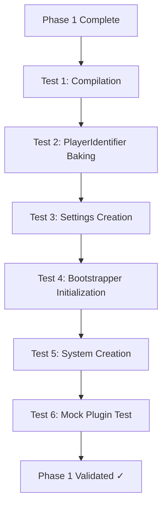
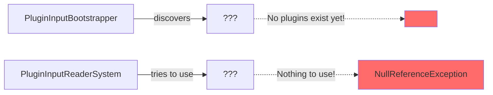

## What You Have So Far (Phase 1)

```
✅ PlayerIdentifier (IComponentData)
✅ PlayerIdentifierAuthoring (MonoBehaviour)
✅ PlayerIdentifierBaker (Baker)
✅ PluginInputProvider (abstract class)
✅ VehicleInputSettings (ScriptableSingleton)
✅ PluginInputBootstrapper
✅ PluginInputReaderSystem
```

---
## The Problem

You **cannot fully test** the system yet because:



**The issue:** You have the infrastructure, but no actual plugins to discover or use.

---

## Solution: Create a Test Plugin

You need a **minimal test plugin** just to verify your infrastructure works. You don't need to implement a full production plugin - just something that returns dummy values.

### Create a Test Plugin (5 minutes of work)

Create one file: `TestDummyInputProvider.cs`

```csharp
using UnityEngine;
using Vehicles.InputProviders;

/// <summary>
/// Minimal test plugin that returns dummy input values.
/// Used to validate Phase 1 infrastructure before implementing real plugins.
/// </summary>
public class TestDummyInputProvider : PluginInputProvider
{
    // Return simple test values - makes debugging easy
    
    public override float GetSteering(int playerId)
    {
        // Return different values per player so we can verify playerId works
        return playerId * 0.1f; // Player 0 = 0.0, Player 1 = 0.1, Player 2 = 0.2
    }

    public override float GetThrottle(int playerId)
    {
        return 0.5f; // Constant 50% throttle
    }

    public override float GetBrake(int playerId)
    {
        return 0.0f; // No braking
    }

    public override float GetHandbrake(int playerId)
    {
        return 0.0f; // No handbrake
    }

    public override float GetBoost(int playerId)
    {
        return 0.0f; // No boost
    }
    
    // Only support automatic - don't need to implement gear methods
    public override HashSet<GearShiftControlType> GetAllowedGearShiftControlTypes()
    {
        return new HashSet<GearShiftControlType> { GearShiftControlType.Automatic };
    }
}
```

**Where to put it:** Anywhere in your project - I'd suggest a temporary folder like `Assets/Tests/` or even right next to your MVC core files temporarily.

---

## Testing Strategy

Now you can verify each piece of Phase 1 works correctly:

### Test 1: Plugin Discovery ✓

**Goal:** Verify `PluginInputBootstrapper` finds your test plugin via reflection.

**Steps:**

1. Enter Play Mode
2. Check the Console
3. 

**Expected Output:**

```
[PluginInputBootstrapper] Discovered plugin: TestDummyInputProvider (Hash: 123456789)
[PluginInputBootstrapper] Initialized: 1 plugins cached.
```

**If it fails:**

- Plugin discovery isn't working
- Check that `DiscoverPlugins()` is being called
- Check that your test plugin is compiled (no errors)

---

### Test 2: VehicleInputSettings Configuration ✓

**Goal:** Verify you can set the active plugin.

**Steps:**

1. Go to `Project Settings → [Your MVC Settings Section]`
2. You should see `VehicleInputSettings` with a dropdown or field for `DefaultPluginHash`
3. Set it to your `TestDummyInputProvider`'s hash

**Expected Result:**

- Settings persist when you close/reopen Unity
- `VehicleInputSettings.Default.DefaultPluginHash` returns the correct value

**If it fails:**

- `VehicleInputSettings` isn't set up as ScriptableSingleton correctly
- May need custom editor script to make it user-friendly

---

### Test 3: PlayerIdentifier Component ✓

**Goal:** Verify the component bakes correctly on entities.

**Steps:**

1. Create a test GameObject with a cube (just for visibility)
2. Add `PlayerIdentifierAuthoring` component
3. Set `playerId = 0`
4. Enter Play Mode
5. Open the Entity Inspector (Window → Entities → Hierarchy)
6. Find your test GameObject's entity

**Expected Result:**

```
Entity [ID]
  ├─ PlayerIdentifier
  │    └─ Id: 0
  └─ ... (other components)
```

**If it fails:**

- Baker isn't running
- Check `PlayerIdentifierBaker` is in correct namespace
- Verify entity conversion is enabled

---

### Test 4: PluginInputReaderSystem Runs ✓

**Goal:** Verify the system is created and attempts to run.

**Steps:**

1. Keep your test GameObject from Test 3
2. Add a `Powertrain.Inputs` component to it (you may need to add this via code temporarily)
3. Add debug logging to `PluginInputReaderSystem.OnUpdate()`:

```csharp
protected override void OnUpdate()
{
    Debug.Log("[PluginInputReaderSystem] OnUpdate called!");
    
    var plugin = PluginInputBootstrapper.GetActivePlugin();
    
    if (plugin == null)
    {
        Debug.LogWarning("[PluginInputReaderSystem] No active plugin found!");
        return;
    }
    
    Debug.Log($"[PluginInputReaderSystem] Using plugin: {plugin.GetType().Name}");
    
    // Rest of your implementation...
}
```

**Expected Console Output (every frame):**

```
[PluginInputReaderSystem] OnUpdate called!
[PluginInputReaderSystem] Using plugin: TestDummyInputProvider
```

**If it fails:**

- System isn't being created by bootstrapper
- `RequireForUpdate` might be blocking it (no entities with required components)
- World might not exist

---

### Test 5: End-to-End Input Flow ✓

**Goal:** Verify input flows from plugin → system → component.

**Setup:**

1. Create test GameObject with:
    - `PlayerIdentifierAuthoring` (playerId = 0)
    - `Powertrain.Inputs` component
2. Create a simple debug system to read the values:

```csharp
using Unity.Entities;
using UnityEngine;

[UpdateAfter(typeof(PluginInputReaderSystem))]
public partial class DebugInputDisplaySystem : SystemBase
{
    protected override void OnUpdate()
    {
        Entities
            .WithAll<PlayerIdentifier>()
            .ForEach((in Powertrain.Inputs inputs, in PlayerIdentifier playerId) =>
            {
                Debug.Log($"[Debug] Player {playerId.Id} - " +
                         $"Steering: {inputs.Steering}, " +
                         $"Throttle: {inputs.Throttle}");
            })
            .WithoutBurst()
            .Run();
    }
}
```

**Expected Console Output (every frame):**

```
[Debug] Player 0 - Steering: 0.0, Throttle: 0.5
```

**This confirms:**

- ✅ Plugin is being queried
- ✅ System is writing to component
- ✅ PlayerId is being passed correctly
- ✅ Values are correct (0.0 steering, 0.5 throttle from our dummy plugin)

**If it fails:**

- System isn't writing to components
- Component isn't being queried correctly
- Plugin methods aren't being called

---

## Quick Validation Checklist

Run through these in order:

```
□ Play Mode starts without errors
□ Console shows plugin discovery message
□ VehicleInputSettings shows correct plugin hash
□ Entity Inspector shows PlayerIdentifier component on test entity
□ Console shows PluginInputReaderSystem OnUpdate messages
□ Console shows correct input values being written
□ Test with playerId = 1, verify steering changes to 0.1
□ Test with no PlayerIdentifier, verify system doesn't run
```

---

## Advanced Test: Multiple Players

Once basic tests pass, verify split-screen logic:

```csharp
// Create 3 test vehicles
GameObject vehicle1 = CreateTestVehicle(playerId: 0);
GameObject vehicle2 = CreateTestVehicle(playerId: 1);
GameObject vehicle3 = CreateTestVehicle(playerId: 2);

// Expected output in DebugInputDisplaySystem:
// Player 0 - Steering: 0.0, Throttle: 0.5
// Player 1 - Steering: 0.1, Throttle: 0.5
// Player 2 - Steering: 0.2, Throttle: 0.5
```

This proves `playerId` is being passed correctly and each vehicle gets its own values.

---

## What You CANNOT Test Yet

These require Phase 2 plugins:

- ❌ Real keyboard/gamepad input (need actual input system plugins)
- ❌ Different gear shift control types (need plugins that implement them)
- ❌ Plugin switching in Project Settings UI (need multiple real plugins)
- ❌ Input responsiveness/feel (dummy values don't change)

---

## When to Move to Phase 2

Move to Phase 2 when:

✅ All 5 tests above pass  
✅ No console errors in Play Mode  
✅ You can add/remove `PlayerIdentifier` and see system behavior change  
✅ Multiple test vehicles receive different steering values based on playerId  
✅ You understand how each piece connects

---

## Troubleshooting Common Issues

### "No plugins discovered"

- Check `TestDummyInputProvider` compiles without errors
- Verify it's not in an Editor folder (won't be included in build assemblies)
- Check namespace is correct

### "System never runs"

- Add entity with **both** `PlayerIdentifier` AND `Powertrain.Inputs`
- Check `RequireForUpdate` isn't blocking it
- Verify system was created by bootstrapper

### "NullReferenceException on plugin"

- Set `VehicleInputSettings.DefaultPluginHash` to match your test plugin's hash
- Plugin discovery might have failed silently - check Console

### "Values always zero"

- `PluginInputReaderSystem` might not be writing correctly
- Check the `ForEach` loop is actually executing
- Add debug logs inside the loop

---

## Summary

**Yes, you can test Phase 1!** Just create one minimal test plugin that returns dummy values. This lets you verify:

1. Discovery works (bootstrapper finds plugins)
2. Configuration works (settings store active plugin)
3. Components work (PlayerIdentifier bakes correctly)
4. System works (reads plugin, writes to entities)
5. Flow works (end-to-end from plugin to component)

Once all tests pass with dummy values, you're ready for Phase 2 where you'll replace the dummy plugin with real input system implementations.

**Time estimate:** 30-60 minutes to create test plugin and run all validation tests.

Want me to help you write the debug systems or troubleshoot any specific test?