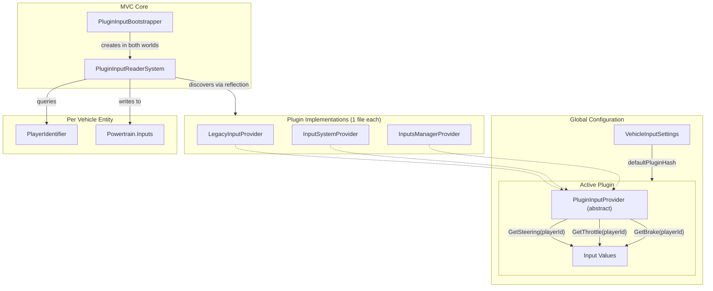
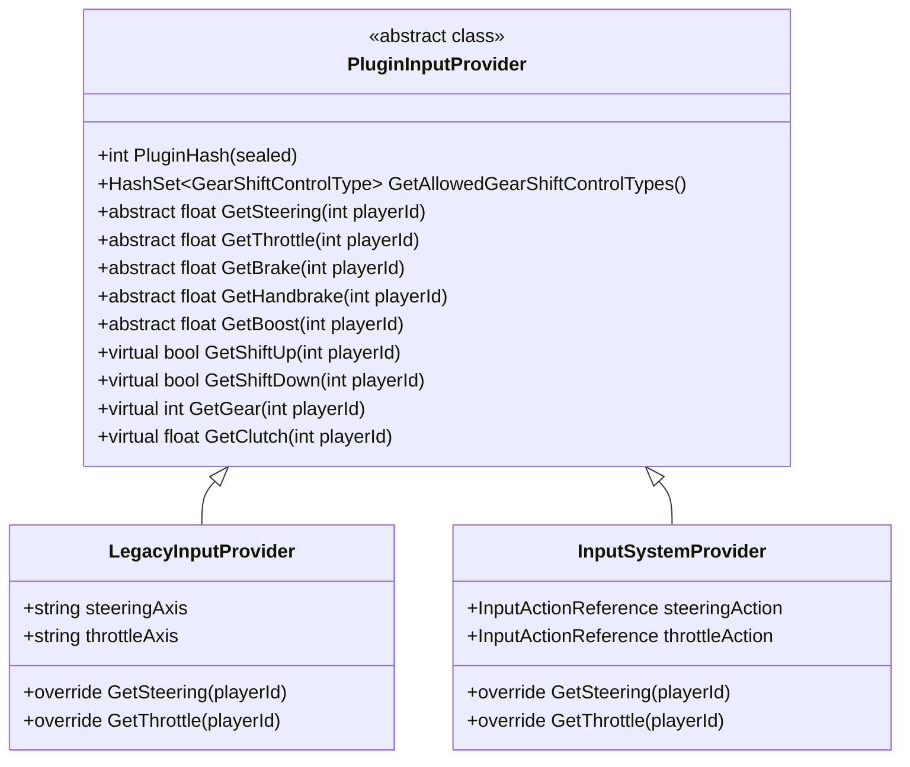
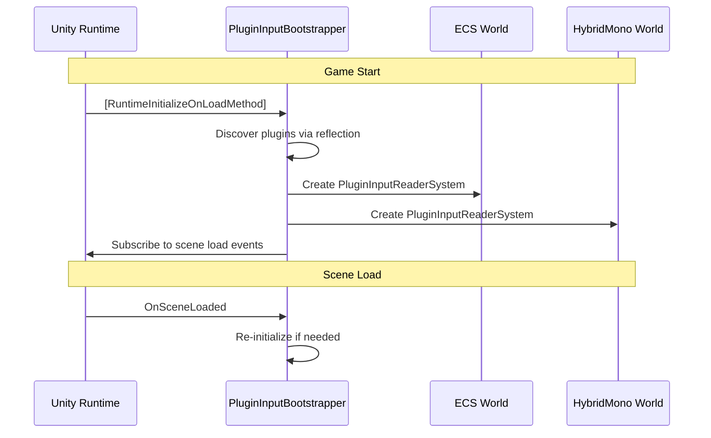
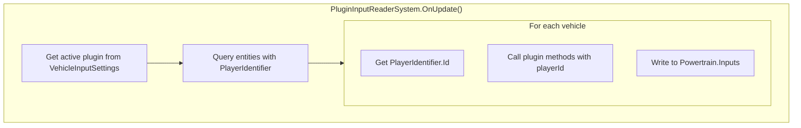
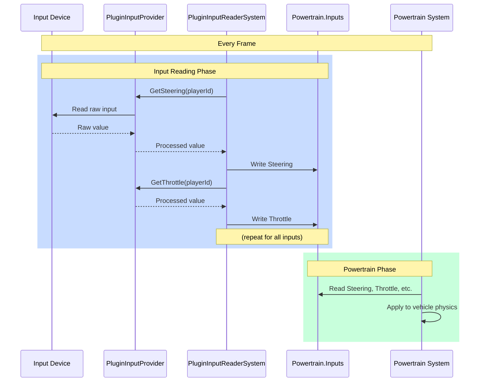
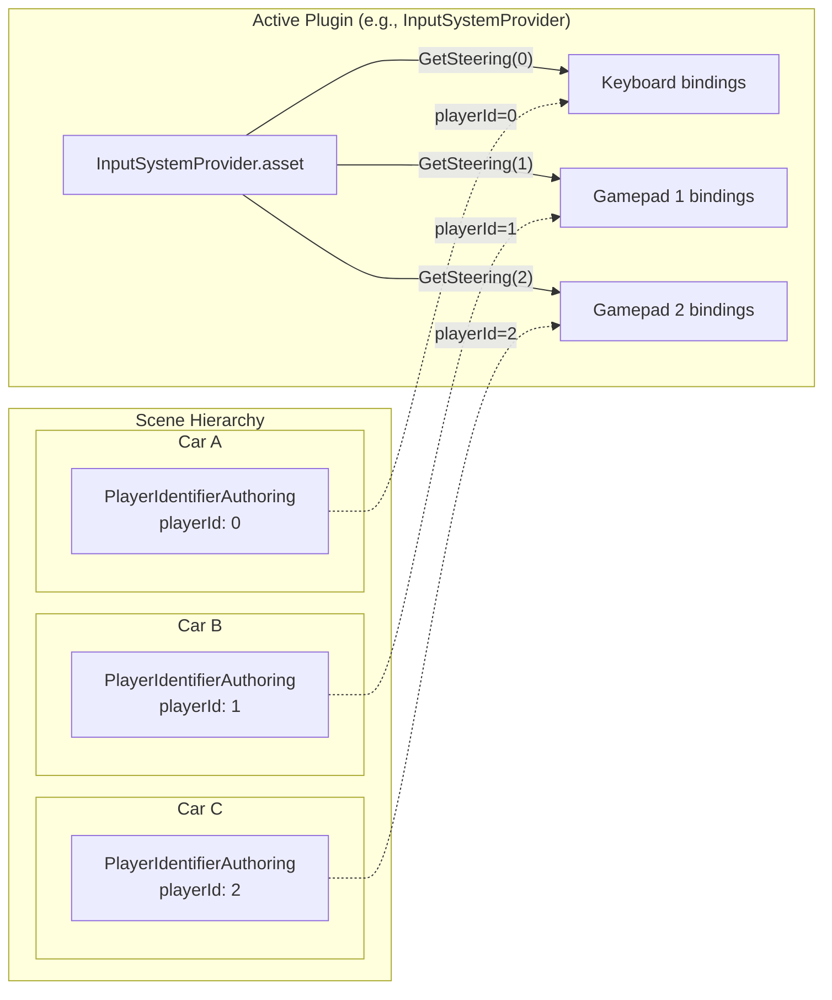
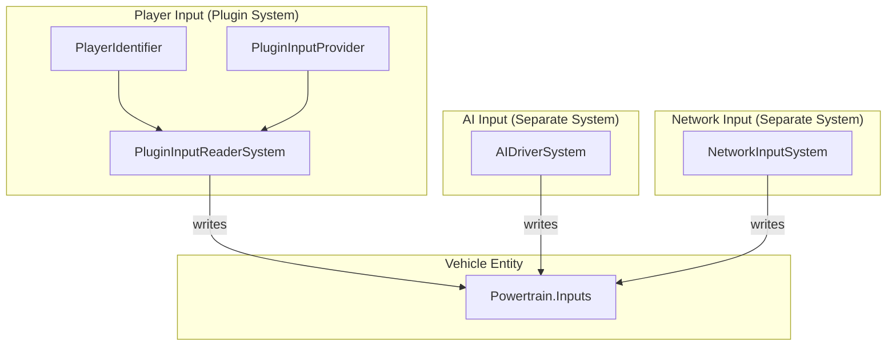

# Detailed Flowchart Walkthrough

Let me go through each flowchart one by one, explaining exactly what's happening.

---

## Flowchart #1: Architecture Overview (The Big System Map)

**Location:** Right at the beginning of the "Architecture Overview" section



### What This Shows: The 50,000-Foot View

This is the **architectural blueprint** showing how all the pieces fit together. Let me trace the flow:

#### Top Section: Global Configuration

```
[VehicleInputSettings] --defaultPluginHash--> [Active Plugin]
```

**What's happening:** There's ONE global settings object that stores a number (hash). This number identifies which plugin is currently active for ALL vehicles in your game.

**Real-world analogy:** Think of this as a radio station selector. The settings say "We're tuned to 101.5 FM" (the hash), and that determines which station (plugin) everyone listens to.

#### Left Section: Plugin Implementations

```
[LegacyInputProvider]
[InputSystemProvider]      } All extend PluginInputProvider
[InputsManagerProvider]
```

**What's happening:** You have multiple plugin files available in your project. Each one is a different way to read input (old Unity Input, new Input System, custom InputsManager, etc.).

**The dotted lines going to "Active Plugin"** mean: "These are all _implementations_ of the abstract PluginInputProvider class."

**Key insight:** You might have 5 plugins installed in your project, but only ONE is active at a time (determined by that hash in VehicleInputSettings).

#### Middle Section: Active Plugin

```
[PluginInputProvider (abstract)]
    ├─> GetSteering(playerId) ──┐
    ├─> GetThrottle(playerId) ──┼─> [Input Values]
    └─> GetBrake(playerId) ─────┘
```

**What's happening:** Whichever plugin is active, it MUST provide these methods. When you call `GetSteering(playerId)`, it returns a float value representing how much the player is steering.

**The playerId parameter is crucial:** It's how we handle multiple players. The plugin internally knows "Player 0 uses keyboard, Player 1 uses gamepad 1, Player 2 uses gamepad 2."

#### Bottom Left: MVC Core

```
[PluginInputBootstrapper] --creates in both worlds--> [PluginInputReaderSystem]
```

**What's happening:**

1. **Bootstrapper** runs at game startup (before any scene loads)
2. It creates the **System** in TWO places:
    - ECS World (for SubScene entities)
    - HybridMono World (for GameObject vehicles)

**Why both worlds?** Because your vehicles might be pure ECS entities OR traditional GameObjects, and we need input for both!

```
[PluginInputReaderSystem] --discovers via reflection--> [Plugins]
```

**What's happening:** The system uses C# reflection to scan your entire project and find every class that extends `PluginInputProvider`. It builds a list: "Okay, I found LegacyInputProvider, InputSystemProvider, and InputsManagerProvider."

Then it looks at the hash in VehicleInputSettings and says: "Aha! The hash matches InputSystemProvider, so THAT'S my active plugin."

#### Bottom Right: Per Vehicle Entity

```
[PluginInputReaderSystem] 
    ├─> queries --> [PlayerIdentifier]
    └─> writes to --> [Powertrain.Inputs]
```

**What's happening every frame:**

**Step 1:** System queries all entities that have a `PlayerIdentifier` component

```
Found 3 vehicles:
- Car A has PlayerIdentifier.Id = 0
- Car B has PlayerIdentifier.Id = 1  
- Car C has PlayerIdentifier.Id = 2
```

**Step 2:** For each vehicle, it reads the playerId and calls the plugin:

```
For Car A (playerId=0):
    steering = activePlugin.GetSteering(0)
    throttle = activePlugin.GetThrottle(0)
    brake = activePlugin.GetBrake(0)
```

**Step 3:** System writes these values to the vehicle's `Powertrain.Inputs` component:

```
Car A.Powertrain.Inputs.Steering = steering
Car A.Powertrain.Inputs.Throttle = throttle
Car A.Powertrain.Inputs.Brake = brake
```

**Then the physics system reads from Powertrain.Inputs and moves the car!**

---

## Flowchart #2: PluginInputProvider Class Diagram

**Location:** In the "PluginInputProvider (Abstract Class)" section



### What This Shows: The Plugin Class Hierarchy

This is a **UML class diagram** showing inheritance relationships.

#### Top Box: PluginInputProvider (The Contract)

```
<<abstract class>>
```

This means you can't create an instance of `PluginInputProvider` directly. It's just a template that says "any child class must implement these methods."

**The methods fall into 3 categories:**

**1. Sealed Property (cannot be overridden):**

```csharp
+int PluginHash (sealed)
```

This is automatically calculated as `GetType().GetHashCode()`. Every plugin gets a unique hash based on its class name. You can't change this - it's locked.

**2. Abstract Methods (MUST implement in child classes):**

```csharp
+abstract float GetSteering(int playerId)
+abstract float GetThrottle(int playerId)
+abstract float GetBrake(int playerId)
+abstract float GetHandbrake(int playerId)
+abstract float GetBoost(int playerId)
```

The `abstract` keyword means: "I'm not providing an implementation. YOU (the child class) must provide one."

Every plugin must answer these questions. No exceptions.

**3. Virtual Methods (optional, but might need implementation):**

```csharp
+virtual bool GetShiftUp(int playerId)
+virtual bool GetShiftDown(int playerId)
+virtual int GetGear(int playerId)
+virtual float GetClutch(int playerId)
```

These have default implementations (they throw `NotImplementedException`), but you override them if your plugin supports manual transmission or clutch control.

#### Bottom Left Box: LegacyInputProvider

```
LegacyInputProvider inherits from PluginInputProvider
```

The arrow `<|--` means "inherits from" or "extends."

**What it adds:**

```csharp
+string steeringAxis  // "Horizontal"
+string throttleAxis  // "Vertical"
```

These are configuration fields specific to Unity's old Input Manager (the one with the Input Settings window where you define axes).

**What it implements:**

```csharp
+override GetSteering(playerId)
```

The implementation looks like:

```csharp
public override float GetSteering(int playerId)
{
    return Input.GetAxis(steeringAxis); // Uses Unity's old Input class
}
```

**Key point:** This plugin ignores `playerId` because the old Input system doesn't have good multi-player support. It just reads from the global axes.

#### Bottom Right Box: InputSystemProvider

```
InputSystemProvider inherits from PluginInputProvider
```

**What it adds:**

```csharp
+InputActionReference steeringAction
+InputActionReference throttleAction
```

These are references to Input Actions from Unity's new Input System (the one with .inputactions files and Action Maps).

**What it implements:**

```csharp
+override GetSteering(playerId)
```

The implementation might look like:

```csharp
public override float GetSteering(int playerId)
{
    // New Input System has proper multi-player support!
    return steeringAction.action.ReadValue<float>();
}
```

**Key point:** The new Input System CAN distinguish between players, so this plugin can properly use `playerId` to read from different devices.

---

## Flowchart #3: Initialization Sequence Diagram

**Location:** In the "PluginInputBootstrapper" section



### What This Shows: Startup Timing

This is a **sequence diagram** showing the order of events when your game starts. Time flows from top to bottom.

#### Phase 1: Game Start (Before Any Scene Loads)

**Event 1:**

```
Unity Runtime --[RuntimeInitializeOnLoadMethod]--> PluginInputBootstrapper
```

**What's happening:** Unity has a special attribute `[RuntimeInitializeOnLoadMethod]` that you can put on a method. This tells Unity: "Run this method BEFORE any scene loads, right when the game starts."

The bootstrapper has a method with this attribute, so Unity calls it automatically.

**Event 2:**

```
Boot->>Boot: Discover plugins via reflection
```

**What's happening:** The bootstrapper talks to itself (internal logic). It uses C# reflection to scan all assemblies and find classes:

```csharp
// Simplified pseudocode of what's happening
var allTypes = AppDomain.CurrentDomain.GetAssemblies()
    .SelectMany(assembly => assembly.GetTypes());

var pluginTypes = allTypes
    .Where(type => type.IsSubclassOf(typeof(PluginInputProvider)))
    .ToList();

// Result: pluginTypes = [LegacyInputProvider, InputSystemProvider, InputsManagerProvider]
```

**Event 3:**

```
Boot->>ECS: Create PluginInputReaderSystem
```

**What's happening:** The bootstrapper gets a reference to the default ECS World and creates the system:

```csharp
// Pseudocode
var ecsWorld = World.DefaultGameObjectInjectionWorld;
ecsWorld.GetOrCreateSystem<PluginInputReaderSystem>();
```

**Event 4:**

```
Boot->>Hybrid: Create PluginInputReaderSystem
```

**What's happening:** Same thing, but for the HybridMono World:

```csharp
// Pseudocode
var hybridWorld = HybridMono.World;
hybridWorld.GetOrCreateSystem<PluginInputReaderSystem>();
```

**Why both?** Because you might have:

- Some vehicles in a SubScene (pure ECS)
- Some vehicles as GameObjects (HybridMono)

Both need input, so we create the system in both worlds!

**Event 5:**

```
Boot->>Unity: Subscribe to scene load events
```

**What's happening:** The bootstrapper registers a callback:

```csharp
// Pseudocode
SceneManager.sceneLoaded += OnSceneLoaded;
```

So whenever a new scene loads, the bootstrapper gets notified.

#### Phase 2: Scene Load (Every Time a Scene Loads)

**Event 6:**

```
Unity Runtime --OnSceneLoaded--> PluginInputBootstrapper
```

**What's happening:** A new scene just loaded. Unity calls our callback function.

**Event 7:**

```
Boot->>Boot: Re-initialize if needed
```

**What's happening:** The bootstrapper checks: "Do I need to recreate the systems? Did something get destroyed?"

This is defensive programming. Usually nothing needs to happen here, but if for some reason the systems were destroyed (maybe in a scene transition), we recreate them.

---

## Flowchart #4: System Update Flow

**Location:** In the "PluginInputReaderSystem (SystemBase)" section



### What This Shows: What Happens Every Frame

This shows the logic inside `PluginInputReaderSystem.OnUpdate()`, which Unity calls 60 times per second (or whatever your framerate is).

#### Step 1: Get Active Plugin

```
[Get active plugin from VehicleInputSettings]
```

**What's happening:**

```csharp
// Pseudocode of what the system does
var settings = VehicleInputSettings.instance;
int activeHash = settings.DefaultPluginHash;

// Find the plugin with matching hash
var activePlugin = allDiscoveredPlugins
    .First(plugin => plugin.PluginHash == activeHash);
```

**Result:** We now have a reference to the active plugin (e.g., `InputSystemProvider`).

#### Step 2: Query Entities

```
[Query entities with PlayerIdentifier]
```

**What's happening:**

```csharp
// In ECS, this is defined somewhere in the system
Entities
    .WithAll<PlayerIdentifier>()
    .WithAll<Powertrain.Inputs>()
    .ForEach((ref Powertrain.Inputs inputs, in PlayerIdentifier playerId) => 
    {
        // Process each vehicle...
    })
    .Run();
```

This finds ALL entities in the world that have BOTH:

- A `PlayerIdentifier` component (so we know which player controls it)
- A `Powertrain.Inputs` component (so we can write input values to it)

**Result:** A list of vehicles that need input. Maybe you have 3:

```
Car A (PlayerIdentifier.Id = 0, Powertrain.Inputs)
Car B (PlayerIdentifier.Id = 1, Powertrain.Inputs)
Car C (PlayerIdentifier.Id = 2, Powertrain.Inputs)
```

#### Step 3: For Each Vehicle (The Inner Loop)

Now we loop through each vehicle found in Step 2:

**Step 3a: Get PlayerIdentifier.Id**

```
[Get PlayerIdentifier.Id]
```

**What's happening:**

```csharp
int playerId = entity.PlayerIdentifier.Id; // e.g., 0, 1, or 2
```

We extract the player ID from the component. This tells us "which player's input should I read?"

**Step 3b: Call Plugin Methods**

```
[Call plugin methods with playerId]
```

**What's happening:**

```csharp
float steering = activePlugin.GetSteering(playerId);
float throttle = activePlugin.GetThrottle(playerId);
float brake = activePlugin.GetBrake(playerId);
float handbrake = activePlugin.GetHandbrake(playerId);
float boost = activePlugin.GetBoost(playerId);
```

We ask the plugin: "What are the input values for THIS player?"

The plugin internally knows:

- Player 0 = Keyboard
- Player 1 = Gamepad 1
- Player 2 = Gamepad 2

So it reads the appropriate device and returns the values.

**Step 3c: Write to Powertrain.Inputs**

```
[Write to Powertrain.Inputs]
```

**What's happening:**

```csharp
inputs.Steering = steering;     // -1.0 to 1.0
inputs.Throttle = throttle;     // 0.0 to 1.0
inputs.Brake = brake;           // 0.0 to 1.0
inputs.Handbrake = handbrake;   // 0.0 to 1.0
inputs.Boost = boost;           // 0.0+
```

We write the values into the vehicle entity's `Powertrain.Inputs` component.

**What happens next (not shown in this flowchart):** Later in the same frame, the `PowertrainSystem` runs. It reads from `Powertrain.Inputs` and applies forces to make the vehicle accelerate, turn, brake, etc.

---

## Flowchart #5: Runtime Data Flow Sequence

**Location:** In the "Runtime Data Flow" section



### What This Shows: Complete Frame Timeline

This is another **sequence diagram**, but focused on showing what happens within a SINGLE frame, across multiple systems. The colored boxes group related operations.

#### Blue Box: Input Reading Phase (Happens First)

**Interaction 1:**

```
System --GetSteering(playerId)--> Plugin
```

**What's happening:** The `PluginInputReaderSystem` is processing a vehicle. It calls the active plugin's `GetSteering()` method, passing in the vehicle's player ID.

**Example:** "Hey InputSystemProvider, what's the steering value for Player 1?"

**Interaction 2:**

```
Plugin --Read raw input--> Device
```

**What's happening:** The plugin internally talks to the actual input hardware:

```csharp
// Inside InputSystemProvider.GetSteering()
var gamepad = Gamepad.all[playerId]; // Get player 1's gamepad
float rawValue = gamepad.leftStick.x.ReadValue(); // Read left stick X-axis
```

**Interaction 3:**

```
Device ----Raw value----> Plugin
```

**What's happening:** The device returns a raw value. For a gamepad analog stick, this might be:

- `0.7532` (not exactly 0.75, because analog input is noisy)
- Value range might be `-1.0` to `1.0`

**Interaction 4:**

```
Plugin ----Processed value----> System
```

**What's happening:** The plugin processes the raw value (maybe applies deadzone, smoothing, sensitivity):

```csharp
// Pseudocode
float raw = 0.7532;

// Apply deadzone
if (Mathf.Abs(raw) < 0.1f) raw = 0;

// Apply sensitivity curve
float processed = Mathf.Pow(raw, 2) * Mathf.Sign(raw);

return processed; // Returns something like 0.57
```

The plugin returns the clean, ready-to-use value to the system.

**Interaction 5:**

```
System --Write Steering--> Powertrain.Inputs
```

**What's happening:** The system writes the processed value to the component:

```csharp
entity.Powertrain.Inputs.Steering = 0.57f;
```

**Then it repeats for throttle:**

```
System->>Plugin: GetThrottle(playerId)
Plugin-->>System: Processed value
System->>Inputs: Write Throttle
```

**And brake, handbrake, boost, etc.** (shown as "repeat for all inputs")

After this phase, the `Powertrain.Inputs` component is fully populated with fresh input values.

#### Green Box: Powertrain Phase (Happens After)

**Interaction 6:**

```
Powertrain System --Read Steering, Throttle, etc.--> Powertrain.Inputs
```

**What's happening:** Later in the frame (based on system update order), the `PowertrainSystem` runs. It reads from the input component:

```csharp
// Inside PowertrainSystem.OnUpdate()
float steering = inputs.Steering;   // 0.57
float throttle = inputs.Throttle;   // 0.85
float brake = inputs.Brake;         // 0.0
```

**Interaction 7:**

```
Powertrain System --Apply to vehicle physics--> Powertrain System
```

**What's happening:** The system uses these values to calculate forces and apply them to the vehicle:

```csharp
// Pseudocode
float steeringForce = steering * steeringStrength; // 0.57 * 50 = 28.5
float driveForce = throttle * enginePower;         // 0.85 * 1000 = 850

ApplyForceToWheels(driveForce);
ApplySteeringAngle(steeringForce);

// Vehicle accelerates and turns!
```

**The loop completes:** Next frame, we start over at the top!

---

## Flowchart #6: Split-Screen Configuration

**Location:** In the "Split-Screen Setup" section



### What This Shows: Multi-Player Setup

This shows the **configuration** (not runtime flow), demonstrating how you set up a split-screen racing game.

#### Left Side: Plugin Configuration

```
[InputSystemProvider.asset]
```

This is a configuration asset (like a ScriptableObject or settings file) where you've set up the plugin's device mappings.

**The arrows show conditional logic:**

```
GetSteering(0) --> Keyboard bindings
GetSteering(1) --> Gamepad 1 bindings
GetSteering(2) --> Gamepad 2 bindings
```

**What this means:** Inside the plugin's code, there's logic like:

```csharp
public override float GetSteering(int playerId)
{
    switch(playerId)
    {
        case 0:
            return Keyboard.current.aKey.isPressed ? -1f : 
                   Keyboard.current.dKey.isPressed ? 1f : 0f;
        
        case 1:
            return Gamepad.all[0].leftStick.x.ReadValue();
        
        case 2:
            return Gamepad.all[1].leftStick.x.ReadValue();
        
        default:
            return 0f;
    }
}
```

The plugin knows: "If you ask for player 0, I read keyboard. If you ask for player 1, I read the first gamepad. If you ask for player 2, I read the second gamepad."

#### Right Side: Scene Setup

You have 3 cars in your scene hierarchy:

```
Car A
  └─ PlayerIdentifierAuthoring
       playerId: 0

Car B
  └─ PlayerIdentifierAuthoring
       playerId: 1

Car C
  └─ PlayerIdentifierAuthoring
       playerId: 2
```

**Each car has a MonoBehaviour** (`PlayerIdentifierAuthoring`) where you manually set the player ID in the Inspector.

#### The Dotted Lines: Logical Connections

```
Car A (playerId=0) -.-> Keyboard
Car B (playerId=1) -.-> Gamepad 1
Car C (playerId=2) -.-> Gamepad 2
```

These dotted lines show the **logical connection** - they're not actual references or code connections. They represent:

"When the system reads input for Car A, it passes playerId=0 to the plugin, which makes the plugin read from the keyboard."

**At runtime, the flow is:**

1. System looks at Car A: "This has PlayerIdentifier.Id = 0"
2. System calls `plugin.GetSteering(0)`
3. Plugin sees `playerId == 0` and executes the keyboard reading code
4. Car A gets keyboard input!

**Same for the other cars:**

- Car B (playerId=1) → plugin reads Gamepad 1
- Car C (playerId=2) → plugin reads Gamepad 2

---

## Flowchart #7: AI and Network Input Separation

**Location:** In the "AI and Network Input" section



### What This Shows: Multiple Input Sources

This shows that **different types of vehicles get input from different systems**, but they all write to the same place.

#### Top Section: Player Input (Plugin System)

```
[PlayerIdentifier] --> [PluginInputReaderSystem]
[PluginInputProvider] --> [PluginInputReaderSystem]
```

**What's happening:** This is the system we've been discussing.

- Vehicles with a `PlayerIdentifier` component are player-controlled
- The `PluginInputReaderSystem` reads from the active `PluginInputProvider`
- It writes to `Powertrain.Inputs`

**Use case:** Local players in split-screen racing

#### Middle Left: AI Input (Separate System)

```
[AIDriverSystem]
```

**What's happening:** There's a completely separate system for AI drivers. It doesn't use plugins at all!

**How it works:**

```csharp
// Inside AIDriverSystem.OnUpdate()
Entities
    .WithAll<AIDriver>() // Different component, not PlayerIdentifier
    .ForEach((ref Powertrain.Inputs inputs) =>
    {
        // AI logic
        float targetSpeed = CalculateTargetSpeed();
        float targetSteer = CalculateSteeringTowardPath();
        
        // Write directly to inputs
        inputs.Throttle = targetSpeed > currentSpeed ? 1f : 0f;
        inputs.Steering = targetSteer;
    })
    .Run();
```

AI vehicles don't have `PlayerIdentifier`, so `PluginInputReaderSystem` ignores them. Instead, `AIDriverSystem` handles them.

#### Middle Right: Network Input (Separate System)

```
[NetworkInputSystem]
```

**What's happening:** For multiplayer racing games, remote players' inputs come over the network.

**How it works:**

```csharp
// Inside NetworkInputSystem.OnUpdate()
Entities
    .WithAll<NetworkPlayer>() // Different component, not PlayerIdentifier
    .ForEach((ref Powertrain.Inputs inputs, in NetworkPlayer netPlayer) =>
    {
        // Get input data from network packet
        var packet = NetworkManager.GetLatestInput(netPlayer.networkId);
        
        // Write to inputs
        inputs.Steering = packet.steering;
        inputs.Throttle = packet.throttle;
        inputs.Brake = packet.brake;
    })
    .Run();
```

Network vehicles don't have `PlayerIdentifier`, so they're ignored by the plugin system.

#### Bottom: The Common Destination

```
[System] ---writes--> [Powertrain.Inputs]
[AIS] ---writes--> [Powertrain.Inputs]
[NIS] ---writes--> [Powertrain.Inputs]
```

**The key insight:** ALL three systems write to the SAME component: `Powertrain.Inputs`

After input phase, it doesn't matter where the inputs came from:

- Player vehicles have inputs from plugins
- AI vehicles have inputs from AI logic
- Network vehicles have inputs from network packets

**But they all look the same to the PowertrainSystem:**

```csharp
// PowertrainSystem doesn't care where inputs came from
Entities.ForEach((ref Powertrain.Inputs inputs) =>
{
    ApplyPhysics(inputs.Steering, inputs.Throttle, inputs.Brake);
})
.Run();
```

**This is separation of concerns at its finest!**

---

## Summary

Each flowchart serves a specific purpose:

1. **Architecture Overview** - 50,000-foot view of how everything connects
2. **Class Diagram** - Shows plugin inheritance structure
3. **Initialization Sequence** - Shows startup timing and order
4. **System Update Flow** - Shows logic within a single system update
5. **Runtime Data Flow** - Shows complete frame timeline across systems
6. **Split-Screen Configuration** - Shows how to set up multi-player
7. **Input Source Separation** - Shows how AI/network input coexists

Does this help clarify each flowchart? Any specific one you