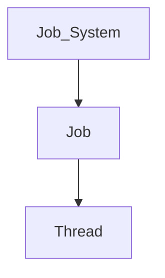
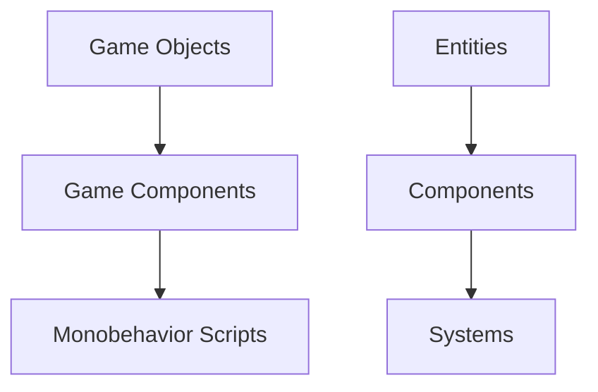
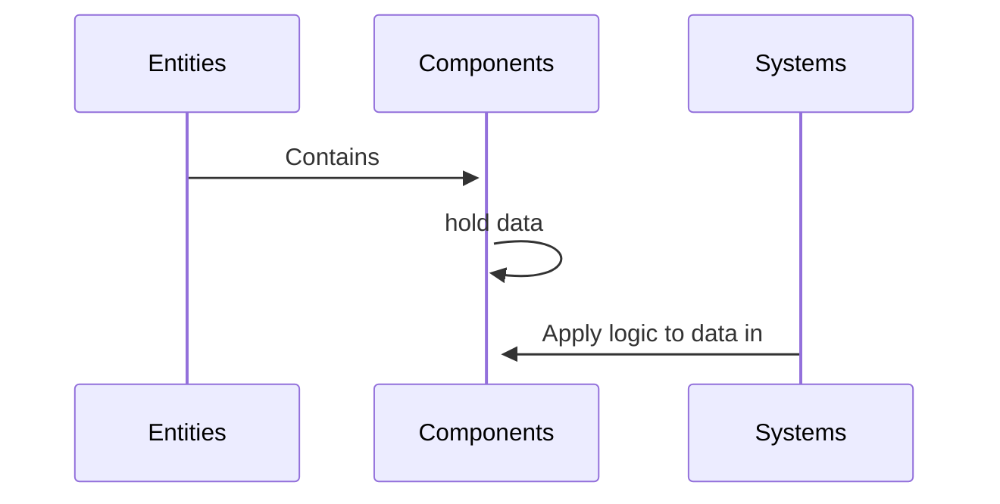
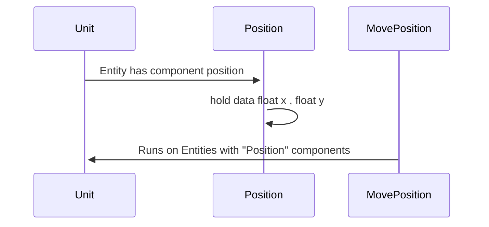

issues with unity 
Main Update thread is single threaded
![[Pathfinding_Threads.png]]

### C# job system

C# multi threaded code you need to :
* manage how many threads you have
* know which one does what
* how man you should have 

creates jobs => runs jobs on threads => Manage C# job system

### ECS
* Separating code between logic and data

![[ECS vs GO data.png| 500]]
* Entities : refer to individual instances of component data
* Systems : Process Data
* Components : 

Example:

#### How memory is set up ?

![[GO Memory Occupation.png]]

* Expensive for CPU (jumping in memory) since GO are located randomly in memory (each component somewhere different) while the update thread is running

![[ECS Memory Occupation.png]]

* Memory is packed together in specific groups of components
* Less expensive on CPU (all data in same place)

### Burst Compiler

C# code => highly optimized machine code

> [!faq]- What to learn?
>*DOTS* stands for data oriented technology stack and is a term that's currently used to refer to ECS, Jobs and Burst.
> 
>ECS stands for entity component system and is actually a part of DOTS. ECS is basically a move away from the typical gameobjects we're used to and to a data oriented approach instead where gameobjects would, in very simple terms, be split into the data (Variables) and then a separate component system (Functions). Instead of gameobjects being put into the scene, you instead have entities which are automatically optimised so that you can have very big numbers of them without big hits to performance. If you want to know more about what goes on in the backend of that then definitely go have a little read around.
>
> Jobs is an easy way to create safer multithreaded code. Since CPUs have multiple cores that can each process things in parallel, jobs basically allows you to write code that can be offloaded to these cores so that multiple bits of code can run at the same time as others. Since most of the code that you write will instead run one after the other, jobs can really improve performance depending on how much you have going on.
> 
> The Burst compiler I don't really know much about but I just know that it can give huge performance a lot when used in tandem with the others.